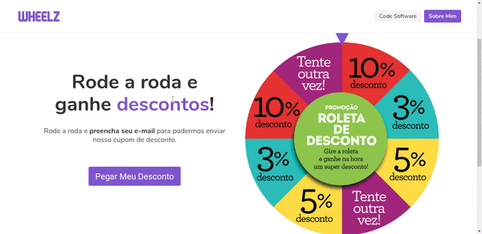

# Wheelz
> Rode a roda e ganhe descontos!

#### Wheelz é uma roleta premiada desenvolvida utilizando VueJS (frontend) e Lumen (backend). ####

*Esta é uma aplicação fictícia e, portanto, os cupons de desconto não são válidos.*




## Instalação
#### Backend
Dentro do diretório backend, execute os comandos abaixo e tenha a API rodando na URL *http://localhost:8081*
```sh
$ docker build -t wheelz-backend .
$ docker run -d -p 8081:8081 --name wheelz-backend wheelz-backend
```
Acesse o container para configurar as variáveis de ambiente no arquivo .env
```sh
$ docker exec -it wheelz-backend /bin/sh
```
Para que o e-mail seja enviado deve-se configurar as variáveis referentes ao SMTP. Para o desenvolvimento desta 
aplicação foi utilizado o serviço de e-mail [Mailtrap](https://mailtrap.io/).


#### Frontend
Dentro do diretório frontend, execute os comandos abaixo e tenha a UI rodando na URL *http://localhost:8080*
```sh
$ docker build -t wheelz-frontend .
$ docker run -d -p 8080:8080 --name wheelz-frontend wheelz-frontend
```

## Autor
Lucas Costa – [Linkedin](https://www.linkedin.com/in/lucashcruzcosta/) - [CodeSoftware](https://www.codesoftware.me)